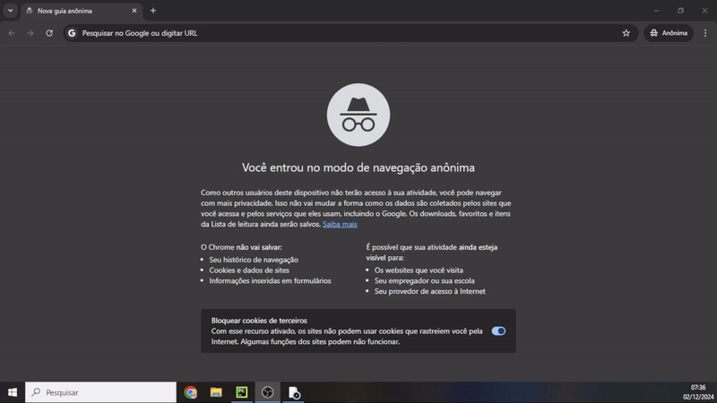

# Teste prático ADVBOX - Migração de Dados

Teste prático para a vaga de Analista Python Júnior na ADVBOX.

# 📜 Índice 

* [Pré-requisitos](#Pré-requisitos)
* [Inicialização](#Inicialização)
* [Tecnologias utilizadas](#Tecnologias-utilizadas)
* [Comentários](#Comentários)
* [Tutorial](#Tutorial)
* [Agradecimentos](#Agradecimentos)

## 📋 Pré-requisitos

Para rodar o projeto você precisará no seu terminal e utilizar o código:

```
pip install -r requirements.txt
```

Com isso, terá todas as bibliotecas necessárias para executar este código.

## 🚀 Inicialização

Execute o arquivo main.py. Após isso, abra em seu navegador o seguinte link:

```
http://127.0.0.1:5000
```

Se não funcionar, verifique o log para o link correto fornecido.

## 🛠️ Tecnologias utilizadas

Este projeto foi desenvolvido utilizando algumas das ferramentas descritas na [vaga](https://www.linkedin.com/jobs/view/4081338347/), tais como:

* [Flask](https://flask.palletsprojects.com/en/stable/) - Framework web para criação de páginas dinâmicas.
* [Pandas](https://pandas.pydata.org/) - Manipulação dos dados.

Para a parte visual, utilizei:

* [Bootstrap](https://getbootstrap.com/docs/5.3/getting-started/introduction/) - Framework front-end para uma interface intuitiva.
* [JavaScript](https://getbootstrap.com/docs/5.3/getting-started/introduction/) - Utilizado para integração da API e manipulação da interface.
* [CSS](https://developer.mozilla.org/pt-BR/docs/Web/CSS) - Estilização personalizada para o layout.

## 🎥 Tutorial



## 📝 Comentários

* Não consegui achar algumas colunas para migrar os dados, principalmente do arquivo de PROCESSOS.xlsx 😔 em uma situação real, pediria ajuda ao senior ou conversaria com os stakeholders para entender melhor as informações necessárias.
* Acredito que esse projeto poderia ser feito também em uma ferramenta de ETL, como o [Knime](https://www.knime.com/), que seria mais fácil a visualização. Eu tenho experiência com esse tipo de ferramenta.
* Deixei o front-end o mais intuitivo o possível. Me inspirei nos sites de "passo a passo" e tutoriais.
* O projeto não está otimizado em vários sentidos(memória, tratamento de erros, etc). Muitos pontos estão com códigos brutos apenas para entregar com uma maior velocidade esse projeto. É possível fazer várias coisas legais se tivesse mais tempo!

## 🎁 Agradecimentos

* Agradeço ao pessoal da ADVBOX pela oportunidade. Espero que gostem!
